# AWAKEN-WALLS

## Andriod app for the Home Automation and Security

There are *6* different phases of the app which I will describe below with some *screenshots*

### 1. INTIALIZER

Here we start the backend service so all the initial setup is done in this phase like **setting up mqtt connection** and getting
the values which may be time-driven or event-driven.

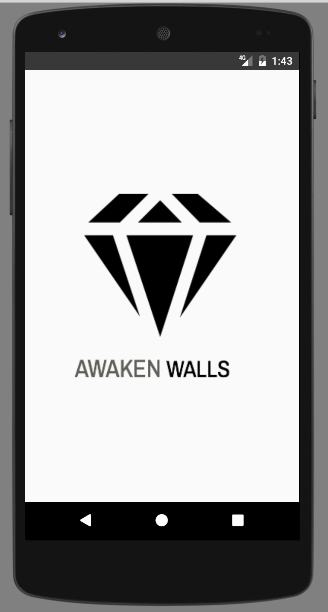

### 2. LOGIN

Here the user will be prompted with the sign in page
  * Enter your username
  * Enter the password 
  * Cilck on *Login* 

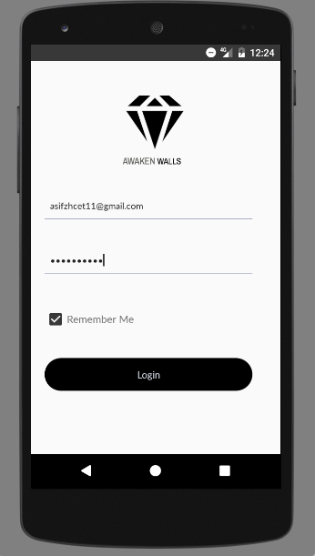 

#### *Future scope - will include sign up page and login by QR code*

So if the user has logged in and remember me has checked then **no need to log in next time**.

### 3. MAIN ACTIVITY
  
  This is the main screen where one can see
    * Custom user profile (profile picture,address and custom configuration(Rooms,Appliances))
    * Menu Bar
    * Pager for displaying the sensor values

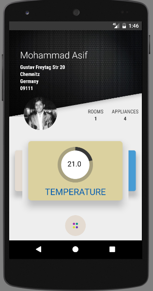     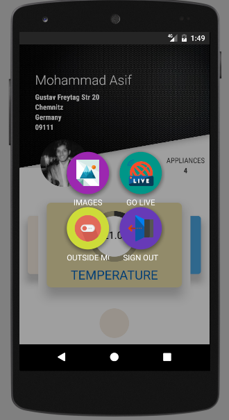  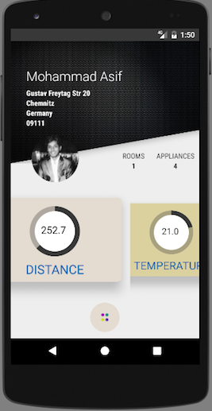

### 4. NOTIFICATION
	
From the menu if you activate outside mode then device(raspberry PI) goes in vigilance mode and whenever it detects any movement it just sends a **Notification** to the user even when the *app is off*.

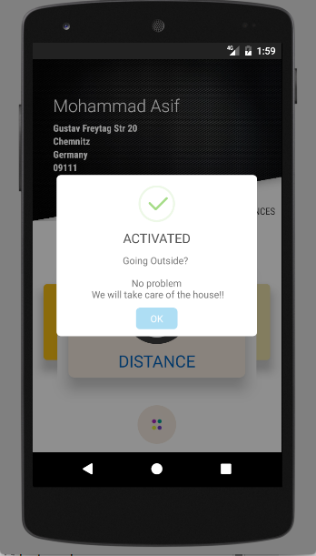     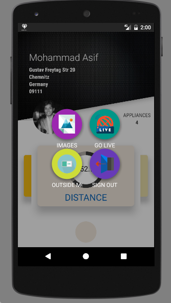

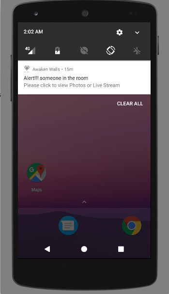     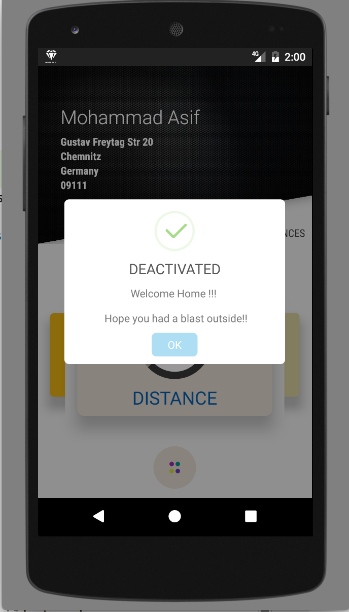

If you click the notification you will redirected to the live stream where you can the **live video** of the person.

### 5. LIVE VIDEO

Here in order to watch live video stream you have to *Go ONLINE* and then click the *play image* and you will be redirected in ypur local browser to the live video stream.

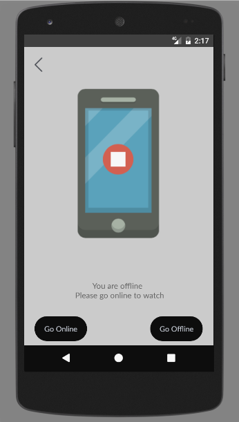     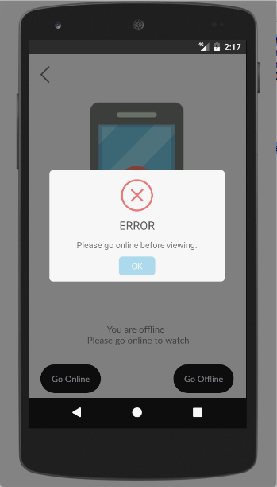

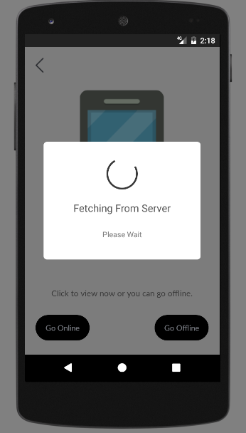     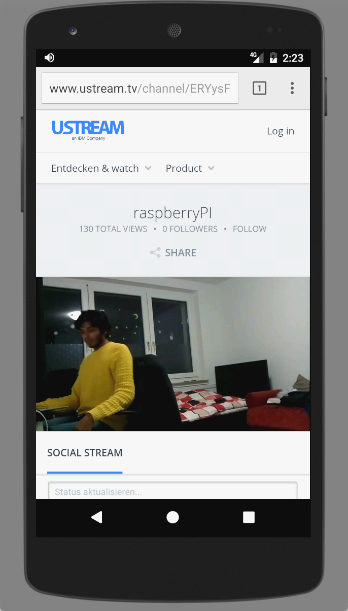

You can always go offline but to view you have to first go online.

### 6. PHOTOS

If you are interested you can also get the photos of the intruder *The device capture 5 images in a gap 5 sec*.

Images are retrievd in terms of packets whose status is also being show **Click on GET**

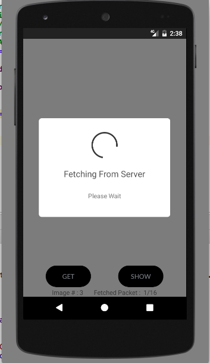

Once message pops to *click show to view* click **SHOW**

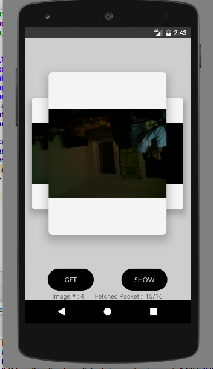

**BUG sometimes app crahes stating BAD BASE64 -- working on this hope to resolve this soon**
	
## SERVER

The server side is coded on *node.js and python*.

     

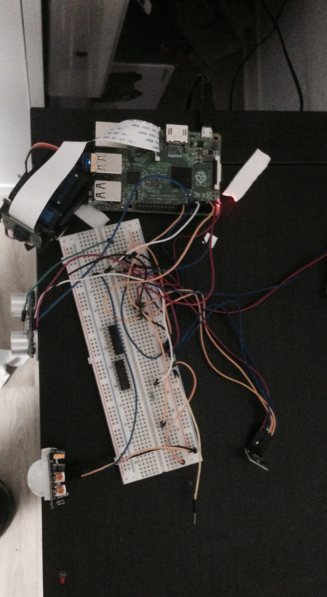     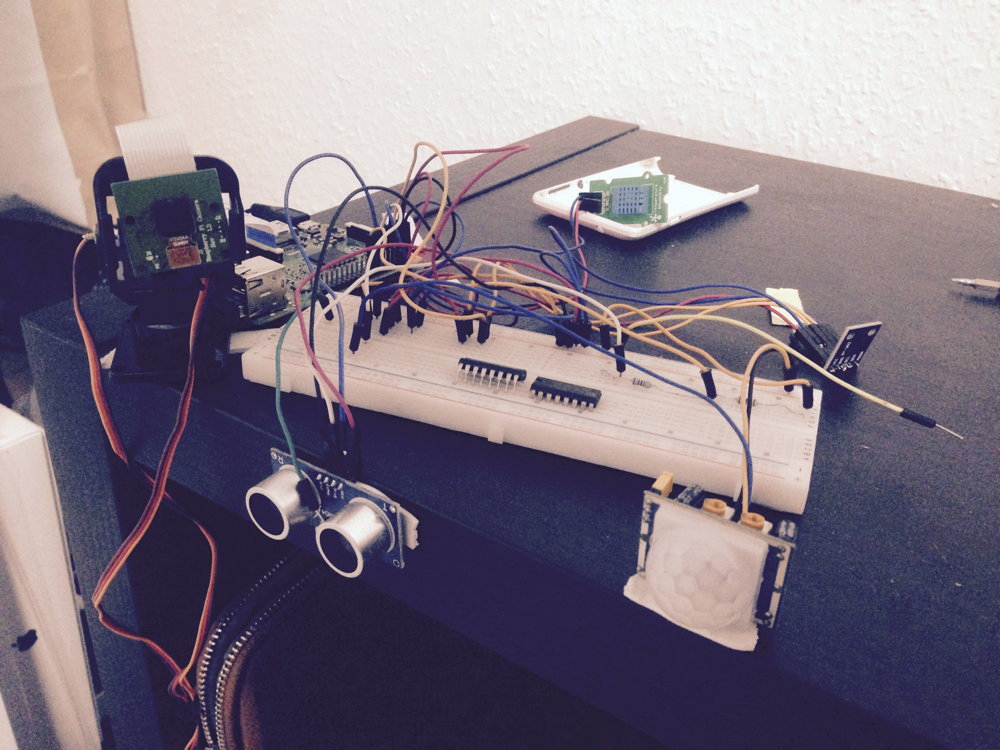

If you want please send a mail to **mohamad.asif@etit.tu-chemnitz.de**.

## FUTURE ADDITION

There are multiple area in which I can work

1. Charts (For temperature,humidity (Heating appliances control), Light(Room lights))
2. Controlling the home appliances like turning off heater and room lights.
3. Bug removal.

	
